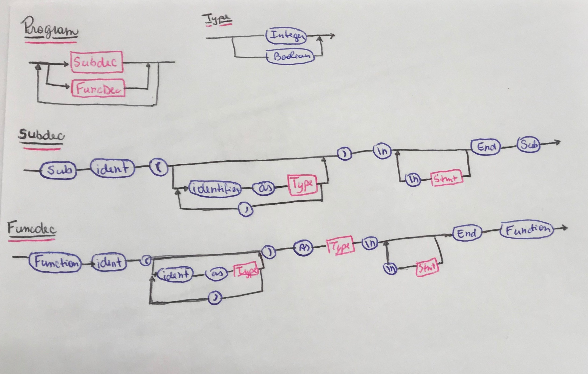
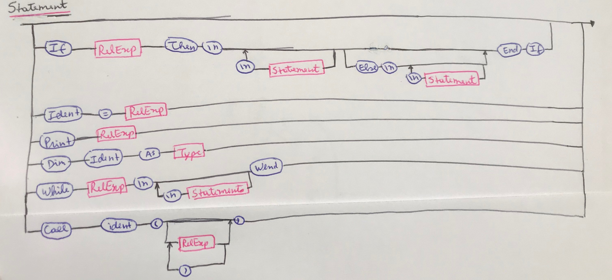
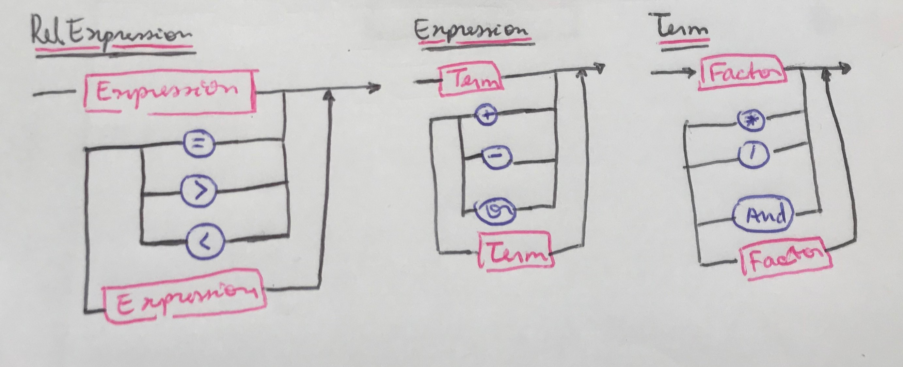
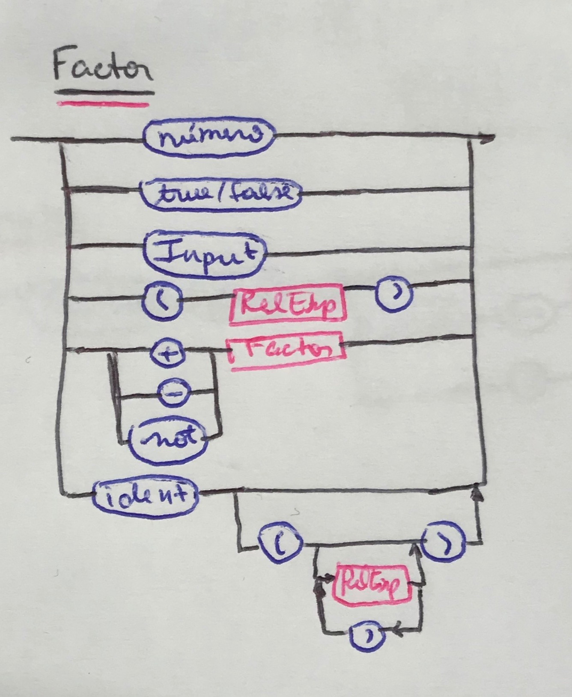

# Compilador_Isabella

### EBNF:
##### Program = {("Sub", SubDec) | ("Function", FuncDec)};
##### SubDec = "Sub", identifier, "(" ("" | identifier, "as", Type, { ",", identifier, "as", Type }), ")", "\n", {Statement, "\n"}, "End, "Sub"
##### FuncDec = "Function", identifier, "(" ("" | identifier, "as", Type, { ",", identifier, "as", Type }), ")", "as", Type, "\n", {Statement, "\n"}, "End, "Function"
##### Statement = "" | (identifier, "=", relexpression) | ("PRINT", relexpression) | ("Dim", identifier, "as", Type) |  ("While", relexpression, "\n" {statement, "\n"}, "Wend") | ("If", relexpression, "Then", "\n", {statement, "\n"}, {"Else", "\n", {statement, "\n"}}, "End", "If") | ("call", identifier, ("(", (Relexpression, {",", Relexpression}) | "", ")") | "");
##### Relexpression = expression, {("="|">"|"<"), expression};
##### Expression = term, {("+"|"-"|"or"), term};
##### Term = factor, {("*"|"/"|"and"), factor};
##### Factor = number | ("True"|"False) | (identifier, "" | ("(", (Relexpression, {",", Relexpression}) | "", ")") ) | ("(", relexpression, ")") | (("+"|"-"|"not"), factor) | "Input";
##### Type = "Integer"|"Boolean";

### Diagrama Sintático:

