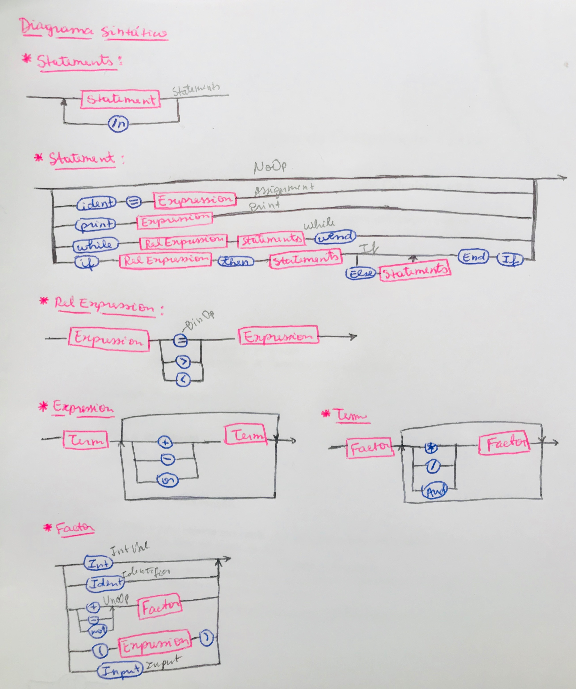

# Compilador_Isabella

### EBNF:
##### Statements = "BEGIN", "\n", {(statement, "\n")}, ("END" | statements);
##### Statement = "" | (identifier, "=", expressão) | ("PRINT", expressão) | statements;
##### expressão = termo, {("+"|"-"), termo};
##### termo = factor, {("*"|"/"), factor};
##### factor = número | identifier | {("(", expressão, ")")} | (("+"|"-"), factor);

### Diagrama Sintático:

